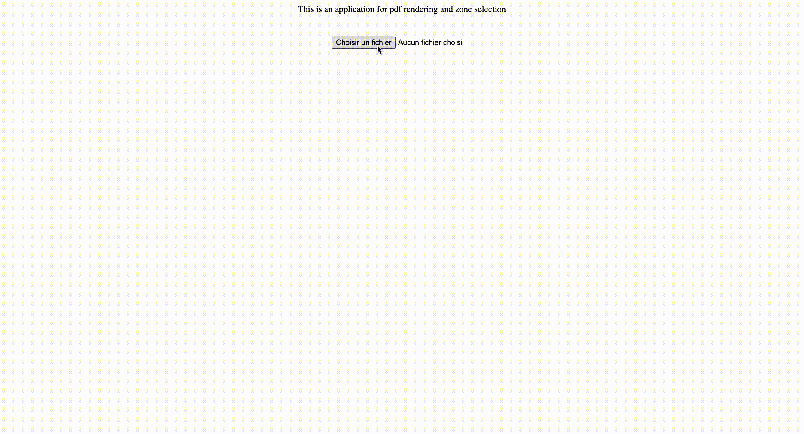

# PDF Region Picker

A project to select only part of a PDF file.

It's usefull when you want to extract informations with some python library like `PyPDF`.



## Requirements

You just need to install node in your computer.

## Usage

```
npm i
npm start
```
